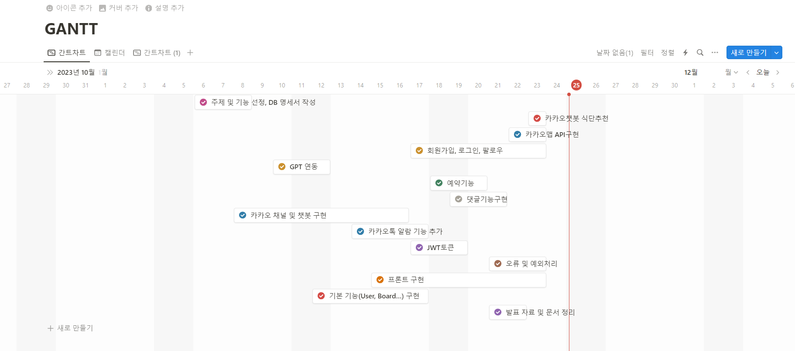

# 프로젝트 이름

   
  
   

## 프로젝트 소개
<a href="https://www.notion.so/3297b6eb5e69428f8293491006258ecc">✨[Notion]HealthPanda✨</a>

단순한 헬스 경험을 넘어, 창의적이고 손쉬운 서비스로 헬스장 이용자들에게 새로운 차원의 편의를 제공하는 프로젝트를 소개합니다.

#### 🏋️ 맞춤 헬스 서비스의 시작:

저희 프로젝트는 대규모 헬스장을 위한 플랫폼으로, 사용자들이 헬스 라이프를 보다 효과적이고 편리하게 즐길 수 있도록 설계되었습니다.

#### 💬 상담 예약 및 이용 후기:

지점별 상담 예약과 다양한 이용 후기를 웹에서 간편하게 확인하세요. 다양한 경험을 통해 헬스 루틴을 개선하고 동기부여를 얻을 수 있습니다.

#### 🍏 맞춤식 식단 관리:

헬스장 사용자들을 위한 식단 관리 시스템으로, 건강한 식습관을 강조합니다. Chat GPT API를 활용하여 유형별 식단 및 칼로리 정보를 손쉽게 얻을 수 있습니다.

#### 🏆 운동 추천 영상:

헬스 루틴에 활력을 불어넣을 최고의 파트너! 추천 운동 영상으로 새로운 운동 방법을 배우고, 몸매 개선을 위한 효과적인 운동을 경험하세요.

#### 📍 헬스장 위치 확인:

각 지점의 정확한 위치를 확인해보세요. 카카오맵을 활용하여 헬스 라이프를 어디서나 편리하게 즐길 수 있습니다.

#### 🤖 카카오 챗봇으로 더욱 간편하게:

식단 추천, 운동 출석 기록, 헬스 정보 검색 등 모든 것을 카카오 챗봇을 통해 손쉽게 해결하세요. 사용자 친화적이고 빠른 응답 시스템으로 헬스 라이프를 더욱 간편하게 즐길 수 있습니다.

#### 🌐 더 나은 헬스 라이프를 위한 새로운 시작, 당신의 편의를 위해 만들어진 플랫폼.

저희 프로젝트는 헬스장 이용자들이 건강한 삶을 더욱 풍부하게 누릴 수 있도록 지원합니다. 사용자 중심의 디자인과 다양한 기능으로, 당신의 헬스 라이프에 혁신을 불러일으키는 새로운 동력을 제공합니다.

 

## 기술 스택

|   java   |  spring  |   vue   |  mySQL  |  gradle  |  javascript  |   
| :------: | :------: | :-----: | :-----: | :------: | :----------: |
| ![java]  |![spring] | ![vue]  |![mySQL] |![gradle] |    ![js]     |

 

## GANTT CHART

 

## 구현 기능

헬스장 이용자들을 위한 종합적이고 편리한 서비스를 제공하기 위해, 웹 플랫폼과 카카오 챗봇을 통합하여 '헬스판다'를 만들었습니다. 헬스판다는 사용자들이 헬스 관리를 보다 효과적으로 할 수 있도록 도와줍니다.

### 1. 웹 서비스:

##### 지점별 상담 예약: 헬스장 이용자들은 편리하게 지점별 상담 예약을 웹에서 할 수 있습니다. 특정 지점의 트레이너와의 상담을 미리 예약하고 효과적인 피드백을 받아보세요.

##### 이용 후기 및 추천 운동 영상: 회원가입한 사용자들은 서로 팔로우하여 작성한 이용 후기를 공유하고, 좋아요를 누른 운동 영상을 감상할 수 있습니다. 다양한 운동 경험을 공유하며 동기부여를 얻어보세요.

##### 좋아요 및 팔로우 기능: 운동 영상에 좋아요를 누르고, 어떤 영상에 좋아요가 많은지 확인하세요. 다른 사용자를 팔로우하면 상대방의 좋아요 목록과 작성한 이용 후기를 볼 수 있습니다.

### 2. 카카오 챗봇 '헬스판다 트레이너봇':

##### 식단 조회 및 기록: 사용자는 간편하게 카카오 챗봇을 통해 자신이 기록한 식단을 조회하고 기록할 수 있습니다. 먹은 음식과 양을 입력하면 칼로리를 계산하여 정확한 식단을 기록해줍니다.

##### 운동 출석 관리: 헬스판다는 사용자가 원하는 시간을 지정하여 운동 출석을 관리합니다. 출석하기를 누르면 지정한 시간을 지켰는지에 대해 피드백을 제공하며, 출석 기록을 데이터베이스에 저장합니다.

##### 운동 출석 조회: 사용자는 과거의 운동 출석 기록을 편리하게 조회할 수 있습니다. 지난 출석 기록을 통해 자신의 운동 일정을 체계적으로 관리하세요.

##### 다이어트 및 운동 식단 추천: 헬스판다 트레이너봇은 GPT를 활용하여 사용자에게 맞춤형 다이어트 및 운동 식단을 추천합니다. 자신의 목적에 맞는 효과적인 식단을 제안 받으세요.

 

## 기능 명세

 

## 클래스 다이어그램

 

## ERD

 

## 배운 점 & 아쉬운 점

배운점
  1. aws를 활용하여 https 배포를 하는 방법에 대해 자세히 알 수 있었습니다. 
  관계형 데이터 베이스 서비스인 RDS를 사용하여 mySql 데이터베이스를 효과적으로 관리하고, EC2, ACM, Route 53 을 이용하여 보안에 적합한 https 프로토콜의 웹페이지를 제작하는 방법을 알게 되었습니다.
  2. spring 의 controller를 모두 rest API로 작성하여 rest API 통신에 대해 보다 깊이 있게 이해할 수 있었습니다. Optional을 적극 활용하여 null 에 대한 처리를 보다 효과적으로 할 수 있게 되었습니다.
  3. spa를 지원하는 vue의 사용법을 자세히 알게 되었고, spa의 작동 원리와 router와 네비게이션 가드에 대해 더 이해하게 되었습니다.
  4. domain을 jpa 의 entity로 구성하기 위하여 공부해서 알게된 것이 많으며, jpa의 메소드를 활용하여 보다 편리하게 데이터베이스를 다루는 방법을 배웠습니다.
  5. jwt 토큰을 적용한 interceptor를 구현하여 유저의 토큰을 확인하고 이에 따라 서비스 로직을 처리할지, 하지 않을지 결정하는 코드를 작성하며 보안 토큰을 다루는 법을 알게 되었습니다.
  6. 함께 협업하며 notion으로 기록을 남기고, git을 사용함에 있어서 협업툴에 대한 이해가 높아졌습니다.

  아쉬운 점
  1. 식단의 칼로리를 계산하는 방식을 처음에는 대용량 데이터로 할까 구상을 하였습니다. 그러나 사용자의 발화가 모호할 때, 예를 들어 사용자가 '뿌링클' 이라고 입력했다면 이를 대용량 데이터는 치킨인지, 소스인지, 감자튀김인지
특정하지 못하는 문제가 있어 사용자의 발화에 유연한 대처가 가능한 gpt를 이용하게 되었습니다. 하지만 gpt 는 음식이 아닌 것을 입력해도 칼로리를 계산하여 돌려주는 문제를 보이기 때문에 아주 적합한 기술 선정을 했다고
말하기는 어렵다고 생각합니다. 사용자의 발화가 음식의 범주에 들어가는지를 1차로 검증한 뒤, 음식의 칼로리를 계산하는 로직으로 변경해야 한다고 생각합니다.
2. spa 페이지 배포로 인한 url 직접 접근 및 새로고침 이슈가 발생했습니다. 이를 ErrorController 를 구현하여 처리하였으나, getMapping 이 아닌
요청이 존재하는 페이지에서는 여전히 이슈가 남아있는 모습을 보입니다. 추후 이를 더 공부하여 이슈를 해결하도록 노력하겠습니다.

배운 점:

1. AWS의 RDS를 이용하여 MySQL 데이터베이스를 관리하고, EC2, ACM, Route 53을 사용하여 안전한 HTTPS 프로토콜의 웹 페이지를 구성하는 방법을 익혔습니다.
2. Spring의 모든 컨트롤러를 REST API로 작성하여 REST API 통신에 대해 깊게 이해하였으며, Optional을 적극 활용하여 null에 대한 처리를 효과적으로 수행할 수 있게 되었습니다.
3. SPA를 지원하는 Vue의 사용법을 자세히 알게 되었고, SPA의 작동 원리와 라우터, 네비게이션 가드에 대한 더 깊은 이해를 얻었습니다.
4. JPA의 엔터티로 도메인을 구성하는 방법에 대해 공부하고, JPA 메서드를 활용하여 데이터베이스를 보다 편리하게 다루는 방법을 습득했습니다.
5. JWT 토큰을 적용한 인터셉터를 구현하여 유저의 토큰을 확인하고, 이에 따라 서비스 로직을 처리할지 여부를 결정하는 코드를 작성하여 보안 토큰을 다루는 방법을 익혔습니다.
6. Notion을 활용하여 협업 기록을 남기고, Git을 효과적으로 사용함으로써 협업에 대한 이해를 높일 수 있었습니다.

아쉬운 점:

1. 식단의 칼로리 계산 방식에 대한 초기 아이디어는 대용량 데이터를 활용하는 것이었으나, 사용자의 발화가 모호할 때, 예를 들어 사용자가 '뿌링클' 이라고 입력했다면 이를 대용량 데이터는 치킨인지, 소스인지, 감자튀김인지
특정하지 못하는 문제를 감지해 사용자의 발화에 유연한 대처가 가능한 Chat GPT를 이용하게 되었습니다.그러나 chat GPT는 음식 외의 것을 입력해도 칼로리를 계산하여 돌려주는 문제가 있기에 여전히 개선이 필요한 부분이 존재합니다. 사용자의 발화가 음식 범주에 들어가는지를 1차로 검증한 뒤, 음식의 칼로리를 계산하는 로직으로 변경해야 하는 등 적합한 기술 활용 방법을 더 고민해야 합니다.
2. SPA 페이지 배포로 인한 URL 직접 접근 및 새로고침 이슈가 발생했습니다. ErrorController를 구현하여 처리하였으나, GET을 제외한 특정 요청에서는 여전히 이슈가 남아있는 상태입니다. 이 부분에 대한 깊은 이해와 해결을 위한 추가 공부가 필요합니다.
 
MIT © NoHack
<!-- Stack Icon Refernces -->
[java]: /images/java.svg
[spring]: /images/spring.svg
[vue]: /images/vue.svg
[mySQL]: /images/mySQL.svg
[gradle]: /images/gradle.svg
